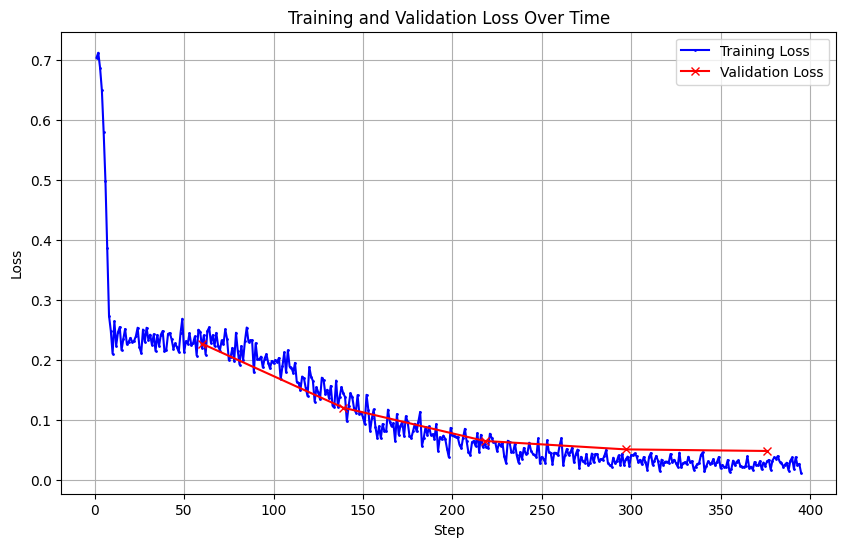
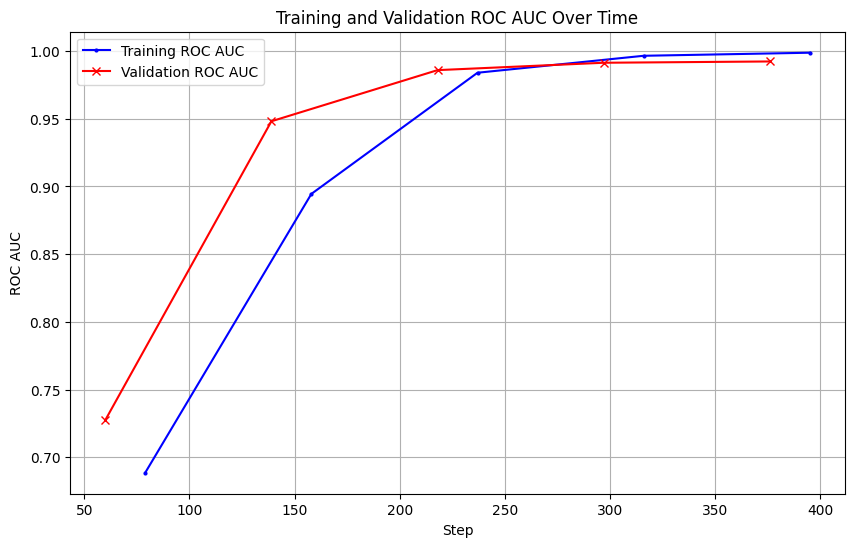
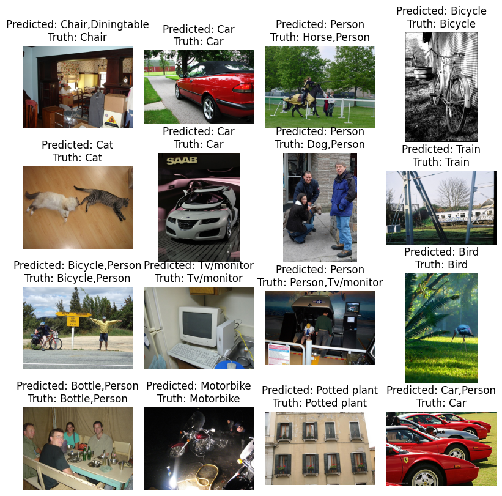

In this [experiment](Finetuning-ViT-multilabel-image-classification.ipynb), fine-tuned a Swin Transformer model, specifically `swin_s3_base_224` from the `timm` library, for multi-label image classification using the Pascal VOC 2007 dataset, achieving an improvement in validation ROC AUC from 72% to 99% after just 5 epochs. (I followed the data preprocessing and training steps in this [tutorial](https://colab.research.google.com/github/johko/computer-vision-course/blob/main/notebooks/Unit%203%20-%20Vision%20Transformers/fine-tuning-multilabel-image-classification.ipynb#scrollTo=7c64af09), but wrote my own scripts.)

The Swin Transformer is a variant of the Vision Transformer (ViT) designed to overcome some of the limitations of the original ViT, such as the fixed size of input patches.

This quick convergence was only possible with learning rate of 2e-4. I experimented with other different learning rates, at which the model would not converge to an acceptable ROC AUC, even at the learning rate of 5e-4 which appears quite close to the 2e-4 learning rate.

The model was fine-tuned using a cosine learning rate schedule, and performance is evaluated using metrics like ROC AUC, calculated via Hugging Face's `evaluate` library.

